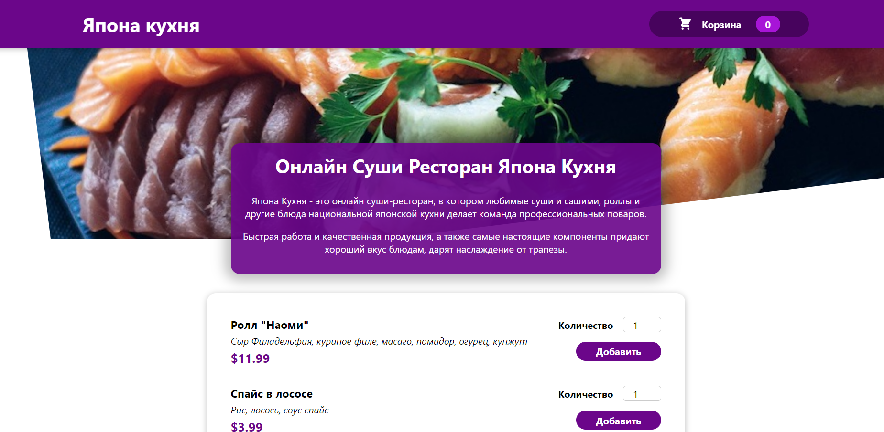

# React application for the Japan cafe website

React application for the Japan cafe website made for study ReactJS purpose



## Technologies:
- Javascript language
- ReactJS library
- Html, CSS

## Features:
- You can add items to the cart
- Price recalculates
- Modal window for the cart and checkout

---

### How to use github actions publishing:
- run `npm install gh-pages --save-dev`
- add to package.json: `"homepage": "https://<your-login>.github.io/<your-repo-name>"`
- add to package.json:
```json
"scripts": {
  "predeploy": "npm run build",
  "deploy": "gh-pages -d build"
}
```
- run `npm run deploy`
- this will create branch `gh-pages` in remote repo with built files
- then try to go to your homepage for the project
- don't forget to set your repo (public + actions is on etc)

---

#### Demo is [here: (VPS)](http://japan-cafe.surkoff.com)  or [here (Github pages)](https://s-rb.github.io/japan-cafe)